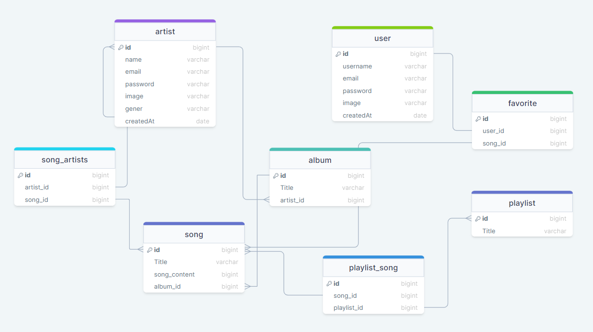

# Spotif
backend for music application like spotify

## Database diagram

## Tools and Packages
* Typescript
* Express
* Prisma(PostgreSQL)
* Docker
* Elasticsearch
* Nodemailer
* jsonWebToken
* joi
* multer
* bcrypt
* crypto

## What is this project about 
* artists can create songs,albums and manage them
* users can add songs to favorites or create playlists and add songs to them 
